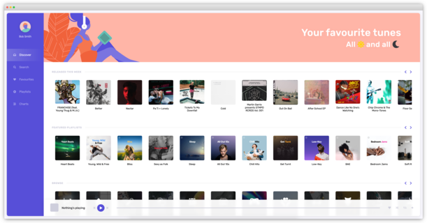
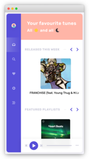

# Beautiful Themed Spootify 
Desktop                                                                                |  Mobile
:-------------------------------------------------------------------------------------:|:-----------------------------:
  |  
&nbsp;

## Highlight ✨
- Next.Js 13
- NextAuth v4
- Spotify Web API for node
- React Hooks 🪝
- React Context 📋

&nbsp;
## Environtment Variables 💻
- `REACT_APP_SPOTIFY_CLIENT_ID`
  - Spotify Client ID, get it from [Spotify Developer Portal](https://developer.spotify.com/dashboard)
- `REACT_APP_SPOTIFY_CLIENT_SECRET`
  - Spotify Client Secret, get it from [Spotify Developer Portal](https://developer.spotify.com/dashboard)
- `BASE_URL`
  - Application base url (usualy used by server side render)
  - default: `http://localhost:3000`
- `NEXTAUTH_URL`
  - Next-Auth base URL path
  - default: `$BASE_URL`
- `NEXTAUTH_SECRET`
  - Generate a secreet using this command
     ```bash
    openssl rand -base64 32
    ```
&nbsp;

## Start Serving Application 🚥
```bash
npm run build 
npm run start
```

&nbsp;
## Development 🔨
```bash
npm run dev
```


&nbsp;
## What's Already Been Done 🏁
- UI/UX for all elements, including previews (mobile responsive)
&nbsp;
